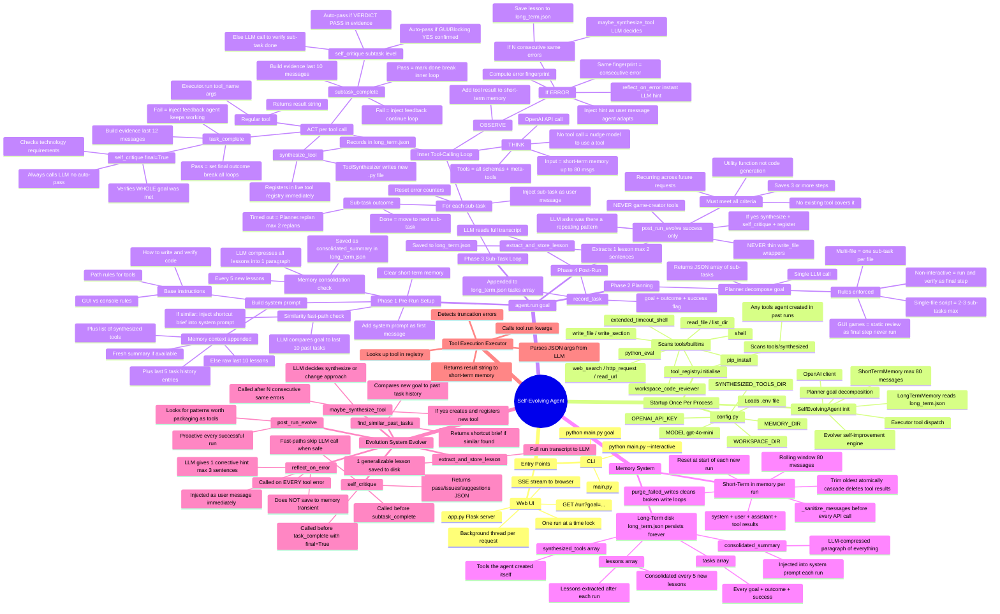

# Self-Evolving Agent — Full Pipeline Mindmap

```mermaid
mindmap
  root((Self-Evolving Agent))

    Entry Points
      CLI
        main.py
        python main.py goal
        python main.py --interactive
      Web UI
        app.py Flask server
        GET /run?goal=...
        Background thread per request
        SSE stream to browser
        One run at a time lock

    Startup Once Per Process
      config.py
        Loads .env file
        OPENAI_API_KEY
        MODEL gpt-4o-mini
        WORKSPACE_DIR
        MEMORY_DIR
        SYNTHESIZED_TOOLS_DIR
      tool_registry.initialise
        Scans tools/builtins
          shell
          write_file / write_section
          read_file / list_dir
          pip_install
          web_search / http_request / read_url
          python_eval
          workspace_code_reviewer
          extended_timeout_shell
        Scans tools/synthesized
          Any tools agent created in past runs
      SelfEvolvingAgent init
        OpenAI client
        ShortTermMemory max 80 messages
        LongTermMemory reads long_term.json
        Evolver self-improvement engine
        Planner goal decomposition
        Executor tool dispatch

    agent.run goal
      Phase 1 Pre-Run Setup
        Memory consolidation check
          Every 5 new lessons
          LLM compresses all lessons into 1 paragraph
          Saved as consolidated_summary in long_term.json
        Build system prompt
          Base instructions
            How to write and verify code
            Path rules for tools
            GUI vs console rules
          Memory context appended
            Fresh summary if available
            Else raw last 10 lessons
            Plus last 5 task history entries
            Plus list of synthesized tools
        Similarity fast-path check
          LLM compares goal to last 10 past tasks
          If similar: inject shortcut brief into system prompt
        Clear short-term memory
        Add system prompt as first message

      Phase 2 Planning
        Planner.decompose goal
          Single LLM call
          Returns JSON array of sub-tasks
          Rules enforced
            Single-file script = 2-3 sub-tasks max
            GUI games = static review as final step never run
            Non-interactive = run and verify as final step
            Multi-file = one sub-task per file

      Phase 3 Sub-Task Loop
        For each sub-task
          Inject sub-task as user message
          Reset error counters
          Inner Tool-Calling Loop
            THINK
              OpenAI API call
              Input = short-term memory up to 80 msgs
              Tools = all schemas + meta-tools
              No tool call = nudge model to use a tool
            ACT per tool call
              subtask_complete
                Build evidence last 10 messages
                self_critique subtask level
                  Auto-pass if VERDICT PASS in evidence
                  Auto-pass if GUI/Blocking YES confirmed
                  Else LLM call to verify sub-task done
                Pass = mark done break inner loop
                Fail = inject feedback continue loop
              task_complete
                Build evidence last 12 messages
                self_critique final=True
                  Always calls LLM no auto-pass
                  Verifies WHOLE goal was met
                  Checks technology requirements
                Pass = set final outcome break all loops
                Fail = inject feedback agent keeps working
              synthesize_tool
                ToolSynthesizer writes new .py file
                Registers in live tool registry immediately
                Records in long_term.json
              Regular tool
                Executor.run tool_name args
                Returns result string
            OBSERVE
              Add tool result to short-term memory
              If ERROR
                Compute error fingerprint
                Same fingerprint = consecutive error
                reflect_on_error instant LLM hint
                Inject hint as user message agent adapts
                If N consecutive same errors
                  Save lesson to long_term.json
                  maybe_synthesize_tool LLM decides
          Sub-task outcome
            Done = move to next sub-task
            Timed out = Planner.replan max 2 replans

      Phase 4 Post-Run
        extract_and_store_lesson
          LLM reads full transcript
          Extracts 1 lesson max 2 sentences
          Saved to long_term.json
        record_task
          goal + outcome + success flag
          Appended to long_term.json tasks array
        post_run_evolve success only
          LLM asks was there a repeating pattern
          Must meet all criteria
            Recurring across future requests
            No existing tool covers it
            Saves 3 or more steps
            Utility function not code generation
          NEVER game-creator tools
          NEVER thin write_file wrappers
          If yes synthesize + self_critique + register

    Memory System
      Short-Term in memory per run
        Rolling window 80 messages
        system + user + assistant + tool results
        Trim oldest atomically cascade deletes tool results
        purge_failed_writes cleans broken write loops
        _sanitize_messages before every API call
        Reset at start of each new run
      Long-Term disk long_term.json persists forever
        tasks array
          Every goal + outcome + success
        lessons array
          Lessons extracted after each run
          Consolidated every 5 new lessons
        synthesized_tools array
          Tools the agent created itself
        consolidated_summary
          LLM-compressed paragraph of everything
          Injected into system prompt each run

    Evolution System Evolver
      reflect_on_error
        Called on EVERY tool error
        LLM gives 1 corrective hint max 3 sentences
        Injected as user message immediately
        Does NOT save to memory transient
      self_critique
        Called before subtask_complete
        Called before task_complete with final=True
        Returns pass/issues/suggestions JSON
        Fast-paths skip LLM call when safe
      maybe_synthesize_tool
        Called after N consecutive same errors
        LLM decides synthesize or change approach
        If yes creates and registers new tool
      extract_and_store_lesson
        Full run transcript to LLM
        1 generalizable lesson saved to disk
      post_run_evolve
        Proactive every successful run
        Looks for patterns worth packaging as tools
      find_similar_past_tasks
        Compares new goal to past task history
        Returns shortcut brief if similar found

    Tool Execution Executor
      Parses JSON args from LLM
      Detects truncation errors
      Looks up tool in registry
      Calls tool.run kwargs
      Returns result string to short-term memory
```
